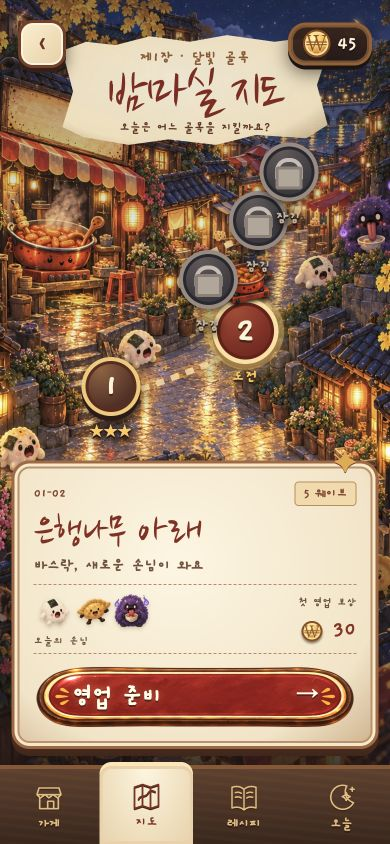
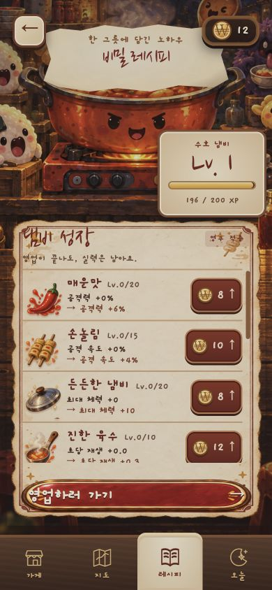
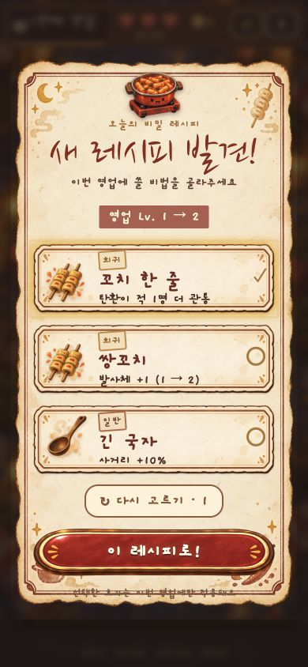
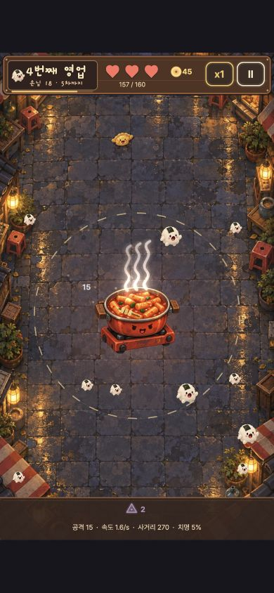
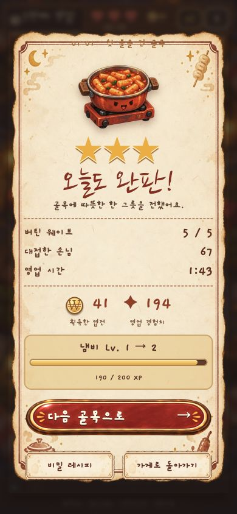

# 검증 기록 (2026-09-26)

- Node 24에서 `npm run build` 성공 (TypeScript 검사 포함).
- `npm test`: 4개 테스트 통과. 구버전 저장 마이그레이션, 손상 데이터, 다음 골목 잠금, 최초 보상 중복 방지, 별/레벨 경계값.
- 브라우저 실제 UI로 메뉴 → 지도 → 첫 골목 5웨이브 완료 → 별 3개, 엽전 41, XP 194 획득 → 2번 골목 해금 확인. 앞선 시험 플레이의 XP가 합산되어 냄비가 Lv.2가 됨.
- 레시피 선택 후 공격 수치 증가 확인. 2배속 플레이 확인.
- 매운맛 강화 구매: 엽전 8개 사용, 강화 Lv.0 → Lv.1. 페이지 새로고침 후 잔액/강화/냄비 레벨 유지 확인.
- 390×844 한국어 메뉴/지도/성장/선택/전투/결과 UI와 320×568 영어 메뉴/지도/성장 UI 확인. 영문 상단 문구가 잔액 표시와 겹치지 않도록 조정함.
- 웹 실행 중 수집한 오류 로그 없음.

아래 이미지는 생성 시안이 아닌 실제 구현 화면의 캡처입니다.

| 메뉴 | 스테이지 | 성장 |
| --- | --- | --- |
|  |  |  |

| 레시피 선택 | 실제 전투 | 실제 클리어 결과 |
| --- | --- | --- |
|  |  |  |

네이티브 기기 빌드/서명과 3~5번 골목의 장시간 밸런스 검증은 이번 웹 검증 범위에 포함하지 않았습니다.
